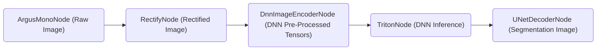

# Tutorial to Run NITROS-Accelerated Graph with Argus Camera



If you have an [Argus-compatible camera](https://github.com/NVIDIA-ISAAC-ROS/isaac_ros_argus_camera), you can also use the launch file provided in this package to start a fully NITROS-accelerated image segmentation graph.

To start the graph, follow the steps below:

1. Follow the [Quickstart section](../README.md#quickstart) up to step 7 in the main README.
   
2. Outside the container, clone additional repositories required to run Argus-compatible camera under `~/workspaces/isaac_ros-dev/src`.

    ```bash
    cd ~/workspaces/isaac_ros-dev/src
    ```

    ```bash
    git clone https://github.com/NVIDIA-ISAAC-ROS/isaac_ros_argus_camera
    ```

    ```bash
    git clone https://github.com/NVIDIA-ISAAC-ROS/isaac_ros_image_pipeline
    ```

3.  Inside the container, build and source the workspace:
    ```bash
    cd /workspaces/isaac_ros-dev && \
      colcon build --symlink-install && \
      source install/setup.bash
    ```
4.  (Optional) Run tests to verify complete and correct installation:
    ```bash
    colcon test
    ```

5. Run the following launch files to start the graph:
    ```bash
    ros2 launch isaac_ros_unet isaac_ros_argus_unet_triton.launch.py model_name:=peoplesemsegnet_shuffleseg model_repository_paths:=['/tmp/models'] input_binding_names:=['input_2:0'] output_binding_names:=['argmax_1'] network_output_type:='argmax'
    ```

6. Visualize and validate the output of the package by launching `rqt_image_view` in another terminal:
    In another terminal, enter the Docker container again:
    ```bash
    cd ~/workspaces/isaac_ros-dev/src/isaac_ros_common && \
      ./scripts/run_dev.sh
    ```
    Then launch `rqt_image_view`:
    ```bash
    ros2 run rqt_image_view rqt_image_view
    ```
    Then inside the `rqt_image_view` GUI, change the topic to `/unet/colored_segmentation_mask` to view a colorized segmentation mask. You may also view the raw segmentation, which is published to `/unet/raw_segmentation_mask`, where the raw pixels correspond to the class labels making it unsuitable for human visual inspection.
